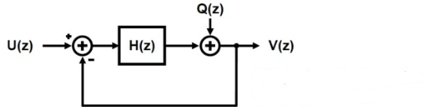

$$
V(z) = U(z)\cdot\frac{H(z)}{1+H(z)}+Q(z)\cdot\frac{1}{1+H(z)}
$$

$$
V(\omega) = K(\omega)\cdot U(\omega) + \left(1-K(\omega)\right)\cdot Q(\omega)
$$

각 필터는 각 축에만 종속적이므로

$$
V(\omega_x, y) = K(\omega_x,y)\cdot U(\omega_x,y) + \left(1-K(\omega_x,y)\right)\cdot Q(\omega_x,y)
$$

$$
V(\omega_x, y) = K(\omega_x)\cdot U(\omega_x,y) + \left(1-K(\omega_x)\right)\cdot Q(\omega_x,y)
$$

$$
v_x(x,y) = k(x) *_x s(x,y) + n(x,y) -k(x) *_x n(x,y) = k(x) *_x s(x,y) + g(x) *_x n(x,y)
$$

비슷하게

$$
v_y(x,y) = k(y) *_y s(x,y) + n(x,y) -k(y) *_y n(x,y)
$$

곱하면

$$
o(x,y) = v_x(x,y) \cdot v_y(x,y) = \left(k(x) *_x s(x,y) + g(x) *_x n(x,y)\right)\cdot\left(k(y) *_y s(x,y) + g(y) *_y n(x,y)\right)
$$

$$
o =(k *_x s)\cdot (k *_y s) + (k *_x s)\cdot( g *_y n) + (k *_y s)\cdot( g *_y n) + ( g *_y n)\cdot(g *_y n)
$$

$$
(k(x) *_x s(x,y))\cdot(g(y) *_y n(x,y))
$$

$$
\left(K(\omega_x) \cdot S(\omega_x,\omega_y)\right) *_{\omega_x,\omega_y} \left(G(\omega_y) \cdot N(\omega_x,\omega_y)\right)
$$

$$
O =
(K(\omega_x) \cdot S(\omega_x,\omega_y)) *_{\omega_x,\omega_y} (K(\omega_y) \cdot S(\omega_x,\omega_y)) + \left(K(\omega_x) \cdot S(\omega_x,\omega_y)\right) *_{\omega_x,\omega_y} \left(G(\omega_y) \cdot N(\omega_x,\omega_y)\right) +
\left(K(\omega_y) \cdot S(\omega_x,\omega_y)\right) *_{\omega_x,\omega_y} \left(G(\omega_x) \cdot N(\omega_x,\omega_y)\right) + (G(\omega_x) \cdot N(\omega_x,\omega_y)) *_{\omega_x,\omega_y} (G(\omega_y) \cdot N(\omega_x,\omega_y))
$$

이때
low freq 에서 convolution과 mutiply는 근사하므로,

$$
\left(K(\omega_y) \cdot S(\omega_x,\omega_y)\right) *_{\omega_x,\omega_y} \left(G(\omega_x) \cdot N(\omega_x,\omega_y)\right)  \approx \left(K(\omega_y) \cdot S(\omega_x,\omega_y)\right) \cdot \left(G(\omega_x) \cdot N(\omega_x,\omega_y)\right) 
$$

$$
\left(K(\omega_y) \cdot S(\omega_x,\omega_y)\right) \cdot \left(G(\omega_x) \cdot N(\omega_x,\omega_y)\right) = K(\omega_y) \cdot S(\omega_x,\omega_y) \cdot G(\omega_x) \cdot N(\omega_x,\omega_y)\\
= K(\omega_y) \cdot S(\omega_x,\omega_y) \cdot \left(1-K(\omega_x)\right)\cdot N(\omega_x,\omega_y)
$$

1차 DSM에서
$H = 1/\omega $, then $K=\frac{1}{1+\omega}$, $1-K = \frac{\omega}{1+\omega}$

$$ 
\therefore \left(K(\omega_y) \cdot S(\omega_x,\omega_y)\right) *_{\omega_x,\omega_y} \left(G(\omega_x) \cdot N(\omega_x,\omega_y)\right)  \approx \frac{1}{1+\omega_y}\cdot \frac{\omega_x}{1+\omega_x} \cdot S(\omega_x,\omega_y)\cdot N(\omega_x,\omega_y)
$$
이때 공간에 대한 주파수를 고려해보면, 축적이 왜곡되지 않는 상황에서는 $\omega_x = \omega_y$가 성립한다.
$$ 
\frac{1}{1+\omega_y}\cdot \frac{\omega_x}{1+\omega_x} \cdot S(\omega_x,\omega_y)\cdot N(\omega_x,\omega_y) = \frac{1}{1+\omega}\cdot \frac{\omega}{1+\omega} \cdot S(\omega,\omega)\cdot N(\omega,\omega)
$$

$\omega$가 0에 수렴하면 $\frac{ \omega }{(1+ \omega )^2}$ 또한 0에 수렴한다.

따라서 $\omega$가 충분히 작은 상황에서 
$\left(K(\omega_y) \cdot S(\omega_x,\omega_y)\right) *_{\omega_x,\omega_y} \left(G(\omega_x) \cdot N(\omega_x,\omega_y)\right) $은 0 으로 수렴한다.

$$
\therefore O \approx
(K(\omega_x) \cdot S(\omega_x,\omega_y))*_{\omega_x,\omega_y} (K(\omega_y) \cdot S(\omega_x,\omega_y)) 
$$
